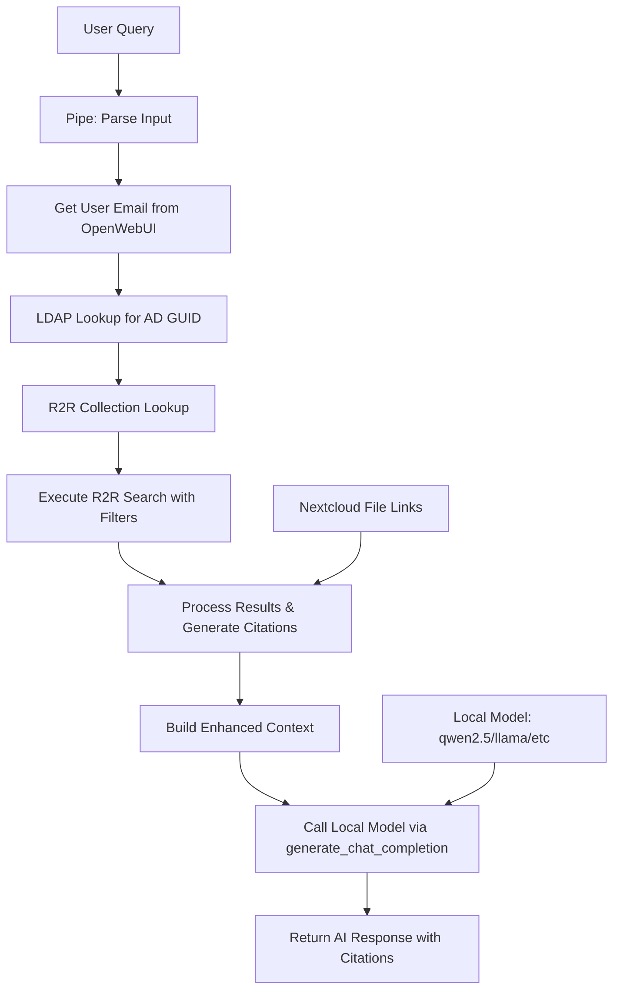

# Nextcloud R2R Search Pipe for OpenWebUI

A comprehensive OpenWebUI pipe that integrates with R2R (RAG to Riches) knowledge bases to provide secure, permission-filtered document search with automatic citation generation and Nextcloud file linking using local models.

## Features

### 🔍 **Intelligent Search**
- Hybrid semantic and keyword search via R2R API
- Configurable search limits and relevance thresholds
- Support for multiple input formats (simple, structured, natural language)
- Automatic query parsing and instruction separation

### 🔐 **Enterprise Security**
- Active Directory LDAP integration for user authentication
- User-specific document collections based on AD GUID
- Automatic permission filtering to ensure users only see authorised content
- Secure service account authentication

### 📚 **Smart Citations**
- Automatic citation ID extraction from document metadata
- Nextcloud file linking with automatic file ID resolution
- Prevention of numbered citations (enforces proper document references)
- Citation format: `[Document Title][https://nextcloud.domain.com/f/8060008]`

### 🏠 **Local Model Integration**
- **Complete data privacy** - all LLM processing happens locally
- No external API calls to LLM services (OpenAI, Anthropic, etc.)
- Configurable local model selection (Qwen, Llama, etc.)
- Uses OpenWebUI's internal `generate_chat_completion` function

### 🎯 **Advanced Query Processing**
- Multiple input formats supported:
  - Simple: `"strategy consulting best practices"`
  - Pipe-delimited: `"strategy frameworks | format as bullet points"`
  - YAML-structured: Separate search terms from presentation instructions
  - Natural language: `"Search for frameworks. Please format as comparison table."`

## Architecture

This pipe appears as a custom model in OpenWebUI that:

1. **Receives user queries** through the standard chat interface
2. **Performs R2R searches** with user permission filtering
3. **Enhances context** with retrieved documents and citations
4. **Routes to local model** (e.g., qwen2.5:30b, llama3.2:70b) 
5. **Returns AI responses** with proper citations and Nextcloud links



## Installation

### Prerequisites

```bash
# Required Python packages
pip install requests pydantic ldap3

# OpenWebUI with pipes support
# Local models (Ollama/LMStudio/etc.)
# R2R instance with collections API
# Active Directory with LDAP access
# Nextcloud instance for file storage
```

### Setup Steps

1. **Install the Pipe**
   - Copy the pipe code to your OpenWebUI pipes directory
   - Restart OpenWebUI to register the new pipe
   - The pipe will appear as "NC R2R (ga3/qwen3:30b-a3b)" in your model selector

2. **Configure Local Models**
   ```bash
   # Ensure your local model is available
   ollama pull qwen3:30b-a3b
   ```

3. **Configure Active Directory**
   ```bash
   # Ensure your AD service account has read access to:
   # - User objects in the specified search base
   # - objectGUID attribute
   # - mail attribute for user lookup
   ```

4. **Setup R2R Collections**
   - Create collections in R2R using user AD GUIDs as collection names
   - Ensure documents are properly assigned to user-specific collections
   - Verify collection API endpoint is accessible

5. **Configure Nextcloud**
   - Ensure file IDs in R2R metadata match Nextcloud file IDs
   - Verify Nextcloud base URL is accessible from user browsers

## Configuration

### Pipe Valves (Settings)

Access pipe settings through OpenWebUI's Admin Panel > Settings > Pipelines.

#### Model Configuration
```python
LOCAL_MODEL = "ga3/qwen3:30b-a3b"  # Your local model
```

#### Connection & Authentication
```python
api_url = "http://your-r2r-server:7272/v3/retrieval/search"
nextcloud_base_url = "https://your-nextcloud.domain.com"  
bearer_token = "your-r2r-bearer-token"
```

#### Active Directory LDAP
```python
ldap_server_uri = "ldap://your-ad-server.domain.com:389"
ldap_bind_user = "service-account@domain.com"
ldap_bind_password = "service-account-password"
ldap_search_base = "DC=company,DC=com"
ldap_user_filter = "(mail={email})"
ldap_guid_attribute = "objectGUID"
ldap_timeout = 10
```

#### R2R Collections
```python
collections_api_url = "http://your-r2r-server:7272/v3/collections/name"
default_owner_id = "your-default-owner-uuid"
```

#### Search & Response Settings
```python
use_hybrid_search = True
search_limit = 10
max_chunks_in_context = 8
max_chars_per_chunk = 1200
min_relevance_score = 0.0
```

#### Permission Settings
```python
enforce_permissions = True  # Set to False for testing only
```

## Usage Examples

Simply select "NC R2R (your-model)" from the model dropdown and chat normally:

### Simple Search
```
Best practices for strategy consulting
```

### Structured Search with Instructions
```
strategy frameworks | Present as comparison table with implementation steps
```

### YAML-Style Input
```yaml
---
search: "Strategic frameworks"
instructions: "Format as bullet points with key differences highlighted"
---
```

### Natural Language
```
Search for digital transformation methodologies. Please format as numbered list with brief descriptions.
```

## Document Structure Requirements

### R2R Metadata Format
Your R2R documents should include metadata in this format:

```json
{
  "title": "Document Title",
  "filename": "files__default:8060008", 
  "source": "Original File Path",
  "document_id": "unique-doc-id",
  "chunk_index": 0,
  "page": 1
}
```

### Collection Setup
- Collections must be named using user AD GUIDs (uppercase)
- Documents assigned to collections based on user access rights
- Collection owner ID should match your R2R configuration

## Citation Format

The pipe generates citations in this format:
```
[Document Title][https://nextcloud.domain.com/f/8060008]
```

Where:
- `Document Title` = Citation ID from metadata (title > source > filename)
- `8060008` = Numeric file ID extracted from `files__default:8060008`

## Security Model

### Data Privacy
- **All LLM processing occurs locally** - no data sent to external APIs if you pipe a local model
- **R2R search data remains internal** to your infrastructure
- **LDAP authentication stays on-premises**
- **Zero external data leakage** once configured properly

### Authentication Flow
1. OpenWebUI provides user context (email) automatically
2. Pipe performs LDAP lookup to get AD GUID
3. R2R collection lookup using GUID
4. Search filtered to user's permitted collection only
5. Results limited to documents user has access to
6. Enhanced context sent to local model only

### Permission Levels
- **Full Access**: User with valid AD account and assigned collection
- **No Access**: User without AD account or collection assignment  
- **Bypass Mode**: For testing (disable in production)

## Troubleshooting

### Common Issues

#### Pipe Not Appearing in Model List
```bash
# Check OpenWebUI logs for pipe registration errors
docker logs openwebui | grep -i pipe

# Verify pipe syntax and imports
python -m py_compile your_pipe.py

# Restart OpenWebUI after pipe installation
docker restart openwebui
```

#### Local Model Not Working
```bash
# Verify model is available locally
ollama list
# or check your local model server

# Test model directly
ollama run qwen3:30b-a3b "Hello"

# Check model name in pipe configuration matches exactly
```

#### Permission Errors
```bash
# Test LDAP connection
ldapsearch -H ldap://your-server -D "service-account@domain.com" -W -b "DC=company,DC=com" "(mail=user@domain.com)"

# Check R2R collections API
curl -H "Authorization: Bearer YOUR_TOKEN" http://r2r-server:7272/v3/collections/name/USER_GUID
```

#### No Search Results
- Verify user has documents in their collection
- Check `min_relevance_score` setting (try 0.0)
- Test search directly against R2R API
- Verify `search_limit` is appropriate

#### Citation/Link Issues
- Check `filename` field format in R2R metadata
- Verify Nextcloud base URL accessibility
- Test file ID extraction with sample metadata

### Debug Mode
Enable detailed logging in the pipe:
```python
# Add to pipe methods for debugging
print(f"Debug: User email: {user_email}")
print(f"Debug: Collection ID: {user_collection_id}")
print(f"Debug: Search results count: {len(chunks)}")
```

## API Reference

### Pipe Structure
```python
class Pipe:
    class Valves(BaseModel):
        LOCAL_MODEL: str = Field(default="ga3/qwen3:30b-a3b")
        # ... other configuration fields
    
    def __init__(self):
        self.valves = self.Valves()
    
    def pipes(self) -> List[Dict[str, str]]:
        # Returns available models for this pipe
        
    async def pipe(self, body: dict, __user__: dict, __request__: Request):
        # Main processing function
```

### Input Processing
The pipe processes various input formats automatically:
- Simple text queries
- Pipe-delimited: `"query | instructions"`  
- YAML-structured with search/instructions separation
- Natural language patterns

### Output Format
Returns the local model's response with:
- Enhanced context from R2R search
- Proper citation formatting instructions
- Nextcloud file links embedded in citations
- Grounded responses based only on retrieved documents

## Performance Tuning

### Search Optimization
```python
# Adjust based on your local model's context window:
search_limit = 20          # More results for powerful models
max_chunks_in_context = 12 # Increase for larger context windows
max_chars_per_chunk = 1500 # Longer chunks for better models
min_relevance_score = 0.2  # Higher threshold for quality
```

### Local Model Settings
```python
# For different model sizes:
# Small models (7B-13B): max_chunks=4, max_chars=800
# Medium models (30B-34B): max_chunks=8, max_chars=1200  
# Large models (70B+): max_chunks=12, max_chars=1500
```

### Network Optimization
```python
request_timeout = 15       # R2R search timeout
ldap_timeout = 5          # LDAP lookup timeout
```

## Model Compatibility

### Tested Models
```bash
# Qwen Models
ga3/qwen3:30b-a3b

```

### Model-Specific Tuning
```python
# For instruction-following models, enhance context with:
# - Clear system prompts
# - Structured formatting requirements
# - Explicit citation rules

# For code models, adjust for:
# - Technical document search
# - API documentation retrieval
# - Implementation examples
```

## Advanced Features

### Custom Instructions
Users can provide specific formatting instructions:
```
financial risk assessment frameworks | Create a comparison matrix with regulatory requirements
```

### Multi-Format Support
```yaml
---
search: "agile methodology comparison"
instructions: "Create executive summary with implementation timeline and resource requirements"
---
```

### Citation Verification
The pipe ensures:
- No numbered citations ([1], [2], [3])
- Proper document titles as citation IDs
- Valid Nextcloud links for all citations
- Metadata preservation for audit trails

## Best Practices

### For Administrators
1. **Use dedicated service accounts** for LDAP and R2R access
2. **Regularly rotate authentication tokens** and passwords
3. **Monitor pipe usage** through OpenWebUI logs
4. **Test permission filtering** with different user accounts
5. **Keep collection assignments current** with user access changes
6. **Choose appropriate local models** for your hardware constraints

### For Users
1. **Use descriptive search terms** rather than generic queries
2. **Leverage structured input** for complex formatting requirements
3. **Verify citation links** before sharing responses externally
4. **Report access issues** to administrators promptly
5. **Select appropriate models** from the dropdown for different tasks

### For Content Managers
1. **Ensure consistent metadata** across all R2R documents
2. **Use meaningful titles** for better citation display
3. **Keep file IDs synchronized** between R2R and Nextcloud
4. **Regular content audits** to verify accessibility
5. **Test document retrieval** across different user accounts

### Testing
```bash
# Unit tests for core functions
python -m pytest tests/unit/

# Integration tests (requires configured environment)
python -m pytest tests/integration/

# Manual testing with pipe
python test_pipe.py --model "qwen2.5:30b" --query "test search"
```

### Code Style
- Follow PEP 8 guidelines
- Use type hints for all functions
- Add docstrings for public methods
- Include error handling for external API calls
- Test with multiple local models

## License

MIT License - see LICENSE file for details

## Support

### Documentation
- [R2R Documentation](https://r2r-docs.sciphi.ai/)
- [OpenWebUI Pipes Guide](https://docs.openwebui.com/features/pipelines/)
- [LDAP3 Python Library](https://ldap3.readthedocs.io/)
- [Ollama Models](https://ollama.ai/library)

### Issues & Feature Requests
- Create issues in the project repository
- Include relevant configuration (sanitised)
- Provide error logs and reproduction steps
- Specify local model versions used

### Community
- OpenWebUI : [OpenWebUI](https://openwebui.com/)
- R2R: [R2R Discussions](https://github.com/SciPhi-AI/R2R/discussions)
- Nextcloud Context Chat Backend: [NC CCBE](https://github.com/nextcloud/context_chat_backend)
- Nextcloud Context Chat Backend R2R version: [NC CCBE R2R](https://github.com/ga-it/context_chat_backend)

---

**Version**: 1.0  
**Author**: GAGPT  
**Last Updated**: 2025/09/26  
**Type**: OpenWebUI Pipe (Local Model Integration)