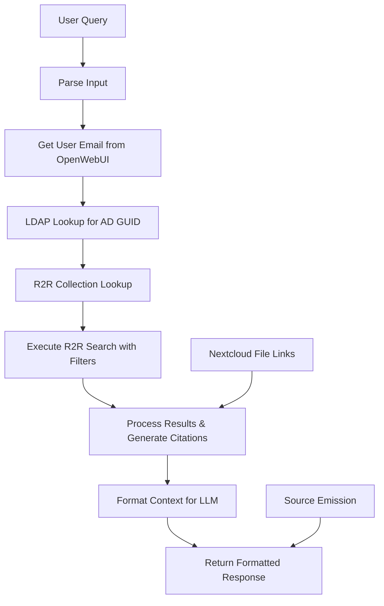

# Nextcloud R2R Search Tool for OpenWebUI

A comprehensive OpenWebUI tool that integrates with R2R (RAG to Riches) knowledge bases to provide secure, permission-filtered document search with automatic citation generation and Nextcloud file linking.

## Features

### 🔍 **Intelligent Search**
- Hybrid semantic and keyword search via R2R API
- Configurable search limits and relevance thresholds
- Support for multiple input formats (simple, structured, natural language)
- Automatic query parsing and instruction separation

### 🔐 **Enterprise Security**
- Active Directory LDAP integration for user authentication
- User-specific document collections based on AD GUID
- Automatic permission filtering to ensure users only see authorised content
- Secure service account authentication

### 📚 **Smart Citations**
- Automatic citation ID extraction from document metadata
- Nextcloud file linking with automatic file ID resolution
- Source emission to OpenWebUI's sources panel
- Prevention of numbered citations (enforces proper document references)

### 🎯 **Advanced Query Processing**
- Multiple input formats supported:
  - Simple: `"strategy consulting best practices"`
  - Pipe-delimited: `"strategy frameworks | format as bullet points"`
  - YAML-structured: Separate search terms from presentation instructions
  - Natural language: `"Search for BCG frameworks. Please format as comparison table."`

## Installation

### Prerequisites

```bash
# Required Python packages
pip install requests pydantic ldap3

# OpenWebUI with tools support
# R2R instance with collections API
# Active Directory with LDAP access
# Nextcloud instance for file storage
```

### Setup Steps

1. **Install the Tool**
   - Copy the tool code to your OpenWebUI tools directory
   - Restart OpenWebUI to register the new tool

2. **Configure Active Directory**
   ```bash
   # Ensure your AD service account has read access to:
   # - User objects in the specified search base
   # - objectGUID attribute
   # - mail attribute for user lookup
   ```

3. **Setup R2R Collections**
   - Create collections in R2R using user AD GUIDs as collection names
   - Ensure documents are properly assigned to user-specific collections
   - Verify collection API endpoint is accessible

4. **Configure Nextcloud**
   - Ensure file IDs in R2R metadata match Nextcloud file IDs
   - Verify Nextcloud base URL is accessible from user browsers

## Configuration

### Tool Valves (Settings)

#### Connection & Authentication
```python
api_url = "http://your-r2r-server:7272/v3/retrieval/search"
nextcloud_base_url = "https://your-nextcloud.domain.com"
bearer_token = "your-r2r-bearer-token"
```

#### Active Directory LDAP
```python
ldap_server_uri = "ldap://your-ad-server.domain.com:389"
ldap_bind_user = "service-account@domain.com"
ldap_bind_password = "service-account-password"
ldap_search_base = "DC=company,DC=com"
ldap_user_filter = "(mail={email})"
ldap_guid_attribute = "objectGUID"
ldap_timeout = 10
```

#### R2R Collections
```python
collections_api_url = "http://your-r2r-server:7272/v3/collections/name"
default_owner_id = "your-default-owner-uuid"
```

#### Search & Response Settings
```python
use_hybrid_search = True
search_limit = 10
max_chunks_in_context = 8
max_chars_per_chunk = 1200
min_relevance_score = 0.0
```

#### Permission Settings
```python
enforce_permissions = True  # Set to False for testing
```

## Usage Examples

### Simple Search
```
Best practices for strategy consulting
```

### Structured Search with Instructions
```
strategy frameworks | Present as comparison table with implementation steps
```

### YAML-Style Input
```yaml
---
search: "McKinsey BCG Bain strategic frameworks"
instructions: "Format as bullet points with key differences highlighted"
---
```

### Natural Language
```
Search for digital transformation methodologies. Please format as numbered list with brief descriptions.
```

## Document Structure Requirements

### R2R Metadata Format
Your R2R documents should include metadata in this format:

```json
{
  "title": "Document Title",
  "filename": "files__default:8060008",
  "source": "Original File Path",
  "document_id": "unique-doc-id",
  "chunk_index": 0,
  "page": 1
}
```

### Collection Setup
- Collections must be named using user AD GUIDs (uppercase)
- Documents assigned to collections based on user access rights
- Collection owner ID should match your R2R configuration

## Citation Format

The tool generates citations in this format:
```
[Document Title][https://nextcloud.domain.com/f/8060008]
```

Where:
- `Document Title` = Citation ID from metadata (title > source > filename)
- `8060008` = Numeric file ID extracted from `files__default:8060008`

## Architecture



## Security Model

### Authentication Flow
1. OpenWebUI provides user context (email)
2. Tool performs LDAP lookup to get AD GUID
3. R2R collection lookup using GUID
4. Search filtered to user's permitted collection
5. Results limited to documents user has access to

### Permission Levels
- **Full Access**: User with valid AD account and assigned collection
- **No Access**: User without AD account or collection assignment
- **Bypass Mode**: For testing (disable in production)

## Troubleshooting

### Common Issues

#### Tool Not Firing
```bash
# Check OpenWebUI logs for errors
tail -f openwebui.log | grep -i tool

# Verify tool registration
# Check browser console for JavaScript errors
# Test with simple query first: "test"
```

#### Permission Errors
```bash
# Test LDAP connection
ldapsearch -H ldap://your-server -D "service-account@domain.com" -W -b "DC=company,DC=com" "(mail=user@domain.com)"

# Check R2R collections API
curl -H "Authorization: Bearer YOUR_TOKEN" http://r2r-server:7272/v3/collections/name/USER_GUID
```

#### No Search Results
- Verify user has documents in their collection
- Check `min_relevance_score` setting (try 0.0)
- Test search directly against R2R API
- Verify `search_limit` is appropriate

#### Citation/Link Issues
- Check `filename` field format in R2R metadata
- Verify Nextcloud base URL accessibility
- Test file ID extraction with sample metadata

### Debug Mode
Enable detailed logging by setting:
```python
# Add to tool initialization
import logging
logging.basicConfig(level=logging.DEBUG)
```

### Health Check
Use the built-in health check:
```python
# Call health_check() method to verify:
# - Bearer token configuration
# - API URL accessibility  
# - Basic connectivity
```

## API Reference

### Main Method
```python
def r2r_search_context(
    query: str,  # Search query or structured input
    user: str = ""  # User context (auto-provided by OpenWebUI)
) -> str  # Formatted context for LLM
```

### Input Formats

#### Simple Query
```
"digital transformation frameworks"
```

#### Pipe-Delimited
```
"search terms | presentation instructions"
```

#### YAML Structure
```yaml
---
search: "actual search terms"
instructions: "formatting requirements"
---
```

### Output Format
The tool returns formatted context including:
- Search results with citation IDs
- Nextcloud file links
- Metadata information
- LLM instructions for proper citation format

## Best Practices

### For Administrators
1. **Use dedicated service accounts** for LDAP and R2R access
2. **Regularly rotate authentication tokens** and passwords
3. **Monitor tool usage** through OpenWebUI logs
4. **Test permission filtering** with different user accounts
5. **Keep collection assignments up-to-date** with user access changes

### For Users
1. **Use descriptive search terms** rather than generic queries
2. **Leverage structured input** for complex requirements
3. **Check citation links** before sharing responses
4. **Report access issues** to administrators promptly

### For Content Managers
1. **Ensure consistent metadata** across all documents
2. **Use meaningful titles** for better citation display
3. **Keep file IDs synchronized** between R2R and Nextcloud
4. **Regular content audits** to verify accessibility

## Performance Tuning

### Search Optimization
```python
# Adjust these settings based on your needs:
search_limit = 20          # More results, slower response
max_chunks_in_context = 5  # Fewer chunks, faster processing
max_chars_per_chunk = 800  # Shorter chunks, more focused results
min_relevance_score = 0.3  # Higher threshold, better quality
```

### Network Optimization
```python
request_timeout = 15       # Balance between reliability and speed
ldap_timeout = 5          # Faster LDAP, potential for failures
```

## Contributing

### Development Setup
```bash
git clone <repository>
cd nextcloud-r2r-tool
pip install -r requirements.txt

# Set up test environment
cp config.example.py config.py
# Edit config.py with your test settings
```

### Testing
```bash
# Unit tests
python -m pytest tests/

# Integration tests (requires configured environment)
python -m pytest tests/integration/

# Manual testing
python test_tool.py --query "test search"
```

### Code Style
- Follow PEP 8 guidelines
- Use type hints for all functions
- Add docstrings for public methods
- Include error handling for external API calls

## License

MIT License - see LICENSE file for details

## Support

### Documentation
- [R2R Documentation](https://r2r-docs.sciphi.ai/)
- [OpenWebUI Tools Guide](https://docs.openwebui.com/features/tools/)
- [LDAP3 Python Library](https://ldap3.readthedocs.io/)

### Issues & Feature Requests
- Create issues in the project repository
- Include relevant configuration (sanitized)
- Provide error logs and reproduction steps

### Community
- OpenWebUI Discord: [OpenWebUI Community](https://discord.gg/openwebui)
- R2R Community: [R2R Discussions](https://github.com/SciPhi-AI/R2R/discussions)

---

**Version**: 1.0  
**Author**: GAGPT  
**Last Updated**: 2024